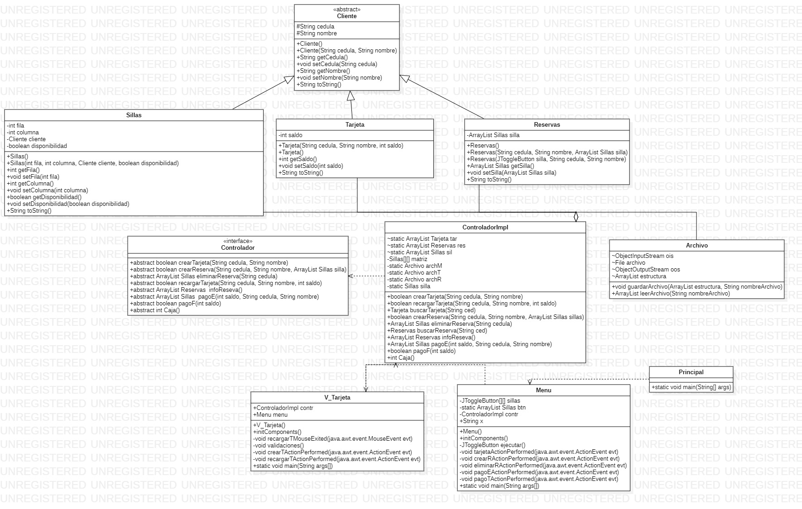

# Sistema de Reservas de Sala de Cine en Java

## Descripción

Este proyecto fue desarrollado como parte de la asignatura de Metodología de la Programación 2, donde se exploraron conceptos avanzados de programación en Java y se profundizó en el paradigma de programación orientado a objetos (POO). A lo largo del semestre, se abordaron temas clave, como arreglos, arreglos de objetos, interfaces gráficas, polimorfismo, herencia y arreglos bidimensionales.

## Características Principales

- **Reservas de Sala de Cine:** El sistema simula la gestión de reservas en una sala de cine, permitiendo a los usuarios reservar asientos y procesar pagos. Las reservas pueden realizarse en efectivo o mediante la creación y recarga de tarjetas.

- **Visualización de Disponibilidad:** Ofrece la capacidad de visualizar en el sistema las sillas disponibles y reservadas en la sala de cine.

- **Pagos y Recargas:** Permite procesar pagos en efectivo y realizar recargas en tarjetas, ampliando las opciones de interacción para los usuarios.

- **Diagrama de Clases UML:** Se implementó y utilizó un diagrama de clases UML para modelar la estructura y relaciones entre las clases del sistema.

- **Sistema Modelo-Vista-Controlador (MVC):** Se aplicó el patrón de diseño MVC para organizar y separar las responsabilidades del modelo, la vista y el controlador, facilitando la modularidad y el mantenimiento del código.

## Conceptos de Programación Aplicados

A lo largo del desarrollo de este proyecto, se aplicaron los siguientes conceptos de programación:

- Arreglos de objetos.
- Interfaces gráficas para mejorar la experiencia del usuario.
- Polimorfismo y herencia para modelar relaciones entre clases de manera eficiente.
- Uso de arreglos bidimensionales para representar la disposición de las sillas en la sala de cine.

## Diagrama de Clases UML

